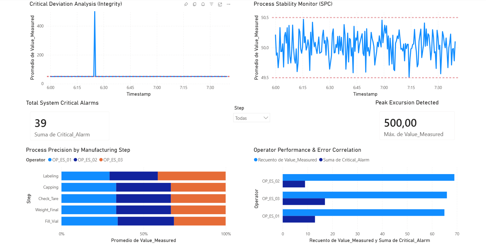

# MES-Manufacturing-Analysis
This project delivers a comprehensive Business Intelligence and Statistical Analysis solution tailored for a pharmaceutical manufacturing environment (MES - Manufacturing Execution System). As a Mathematician, I have focused this analysis on critical deviation detection, operator traceability, and quality control under GxP standards.

🚀 Project Overview
The goal of this project is to transform raw production logs from a fill-finish line into an actionable oversight dashboard. The system monitors vial weighing processes, identifying anomalies that could compromise patient safety or plant efficiency in a high-stakes manufacturing setting.

📊 [Dashboard Preview]

🛠️ Technical Skills Demonstrated

Mathematical & Statistical Analysis: Implementation of Statistical Process Control (SPC) and outlier detection through dispersion analysis.

Data Engineering (ETL): Cleaning and normalization of MES data (Timestamps, decimal delimiters, and data types) using Python and Power Query.

Business Intelligence (Power BI): Designing high-resolution dashboards with critical KPIs (Peak Excursions, Alarm Counts, and Error Ratios).

Domain Knowledge (Pharma): Application of ALCOA+ principles and deviation management according to quality regulations.

📈 Key Insights

1. Excursion Detection: Identification of a critical deviation of 500mg (+900% of nominal value) during the Fill_Vial stage.

2. Error Correlation: Analysis reveals that Operator 03 accounts for the highest volume of critical alarms, suggesting a need for technical review or targeted retraining.

3. Process Stability: Real-time monitoring of variability within established Control Limits (49.5mg - 50.5mg).

📂 Repository Structure

/data: Original production logs (anonymized).

/scripts: Python Notebook (Google Colab) used for data pre-processing and validation.

/reports: Power BI .pbix file and dashboard exports.

/documentation: Deviation Report (DR) detailing the investigation of the 500mg error and proposed CAPA (Corrective and Preventive Actions).

⚖️ Data Integrity Statement
This project was developed with an ALCOA+ mindset:

Attributable: Full traceability by operator and process step.

Legible: Clear visualizations for immediate decision-making.

Original: Data processed directly from the primary MES source.

Accurate: Mathematical validation of weights and alarm correlations.

💡 Next Steps
To review the detailed root cause analysis regarding the 500mg deviation, please refer to the Deviation Report located in the documentation folder.
